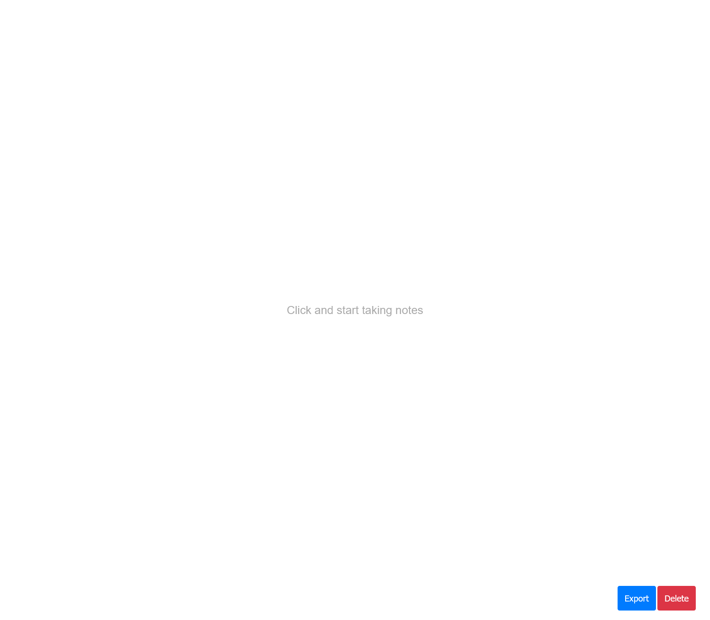
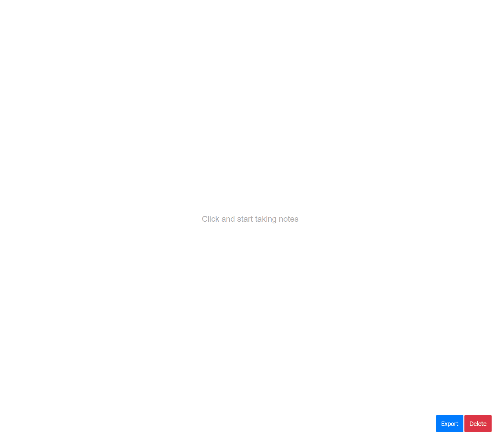

<p align="center">
  <a href="https://github.com/lsprr/note">
    
  </a>
  <h1 align="center">Note</h1>
</p>

## Table of Contents

- [About The Project](#about-the-project)
  - [Built With](#built-with)
- [Demo](#demo)
- [Getting Started](#getting-started)
  - [Installation](#installation)
- [License](#license)

## About The Project

📝 A simple and free note taking web app

### Built With

- [Parcel](https://parceljs.org/)
- JavaScript ES6
- CSS

### Demo

Coming Soon!



## Getting Started

### Installation

1. Clone the repo

2. Install NPM packages

```sh
npm install
```

3. Runs the app in the development mode.

```sh
npm run start
```

4. Open [http://localhost:1234](http://localhost:1234) to view it in the browser.

## License

This project is open source and available under the [MIT License](LICENSE).